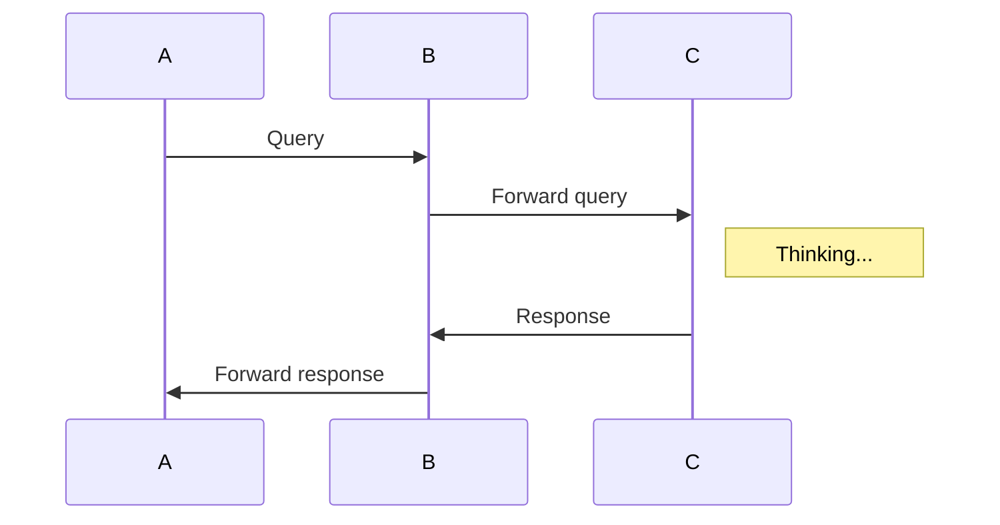

不晓得哪里出了问题，总之是一个有点棘手的bug。。。。mermaid无法识别，于是无法作图。。。好像flow也出了问题。。。解决中
<!--more-->
## 聊聊如何方便的使用图

markdown下的制图非常的美观又方便，我常用的是**标准流程图** ，时序图和甘特图以前在软件工程的课上有使用过，后来接触的就比较少了，而且用的工具也不是markdown，是更为专业点的软件Rose（好像是）。总而言之，今天总结下这些形形色色的图。免得日后使用的时候一通bing、一脸懵，。

下面先介绍工具。

##  flow

[flowchart.js github site](https://github.com/adrai/flowchart.js)

[another](https://jingyan.baidu.com/article/48b558e3035d9a7f38c09aeb.html)

标签类型：start, end, operation, subroutine, condition, inputoutput, parallel

流程图的语法分为两部分，前面部分用来定义流程图元素，后面部分用来连接流程图元素，指定流程图的执行走向。

定义元素阶段的语法是：**tag=>type:content:>url**, e.g.: st=>start: Start

tag: 名称任意

type: 名称固定

content: 任意，冒号与文本之间要有空格。

连接流程图元素阶段的语法：使用->来连接两个元素，对于condition类型，有yes和no两个分支。每个分支可以定义分支走向，默认向下。

示例：

- st=>start: 开始
- op1=>operation: 操作、执行说明
- cond=>condition: 确认
- e=>end: 结束
- parallel(path1, )->x; parallel(path2, )->x

```flow
st=>start: Start:>http://www.google.com[blank]
e=>end:>http://www.google.com
op1=>operation: My Operation
sub1=>subroutine: My Subroutine
cond=>condition: Yes
or No?:>http://www.google.com
io=>inputoutput: catch something...
para=>parallel: parallel tasks

st->op1->cond
cond(yes)->io->e
cond(no)->para
para(path1, bottom)->sub1(right)->op1
para(path2, top)->op1
```

##  mermaid

 Generation of diagram and flowchart from text in a similar manner as markdown 

以上是官方的介绍，以下是官方的demo

```markdown
sequenceDiagram
A->> B: Query
B->> C: Forward query
Note right of C: Thinking...
C->> B: Response
B->> A: Forward response
```



很强大有没有。。不是很懂这是啥图，下面还有正经的甘特图：

```markdown
gantt
dateFormat  YYYY-MM-DD
title Shop项目交付计划

section 里程碑 0.1 
数据库设计          :active,    p1, 2016-08-15, 3d
详细设计            :           p2, after p1, 2d

section 里程碑 0.2
后端开发            :           p3, 2016-08-22, 20d
前端开发            :           p4, 2016-08-22, 15d

section 里程碑 0.3
功能测试            :       p6, after p3, 5d
上线               :       p7, after p6, 2d
交付               :       p8, afterp7, 2d
```


```mermaid
gantt
dateFormat  YYYY-MM-DD
title Shop项目交付计划

section 里程碑 0.1 
数据库设计          :active,    p1, 2016-08-15, 3d
详细设计            :           p2, after p1, 2d

section 里程碑 0.2
后端开发            :           p3, 2016-08-22, 20d
前端开发            :           p4, 2016-08-22, 15d

section 里程碑 0.3
功能测试            :       p6, after p3, 5d
上线               :       p7, after p6, 2d
交付               :       p8, afterp7, 2d
```

### 时序图

第一行使用` sequenceDiagram `关键词声明。

参与者使用` participant `声明。

 消息声明是使用`[参与者][发送方式][参与者]:消息内容`形式声明。

发送方式有如下几种：

- 无箭头的实线、虚线
- 有箭头的实线、虚线
- 有x的实线、虚线

```sequence
Title: 标题：复杂使用

对象A->对象B: 对象B你好吗?（请求）

Note right of 对象B: 对象B的描述

Note left of 对象A: 对象A的描述(提示)

对象B-->对象A: 我很好(响应)

对象B->小三: 你好吗

小三-->>对象A: 对象B找我了

对象A->对象B: 你真的好吗？

Note over 小三,对象B: 我们是朋友

participant C

Note right of C: 没人陪我玩
```


### 甘特图

说了那么多，先贴下[official site]( https://mermaidjs.github.io/#/ )，简直是宝库。慢慢更新。。。