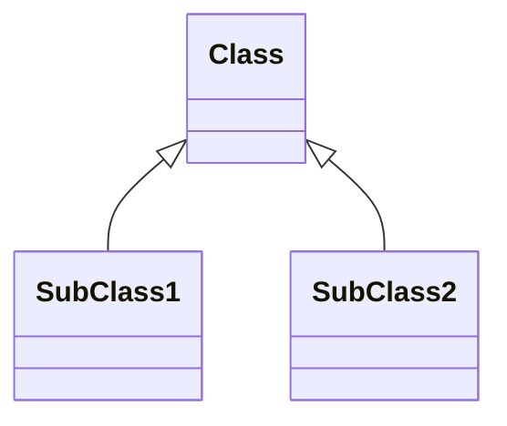
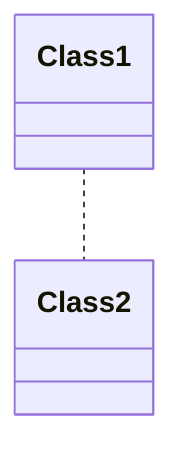
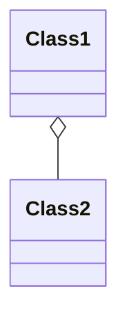
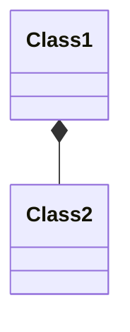
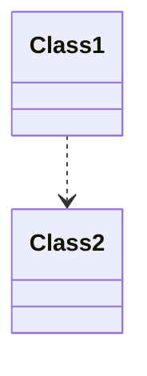

The **Unified Modeling Language(UML)** is a general-purpose, developmental, modeling language in the field of software engineering that is intended to provide a standard way to visualize the design of a system.

<!-- more -->

# 序

主要说说UML中的关系(Class Relationships)

[reference1](https://www.visual-paradigm.com/cn/guide/), [reference2](https://support.typora.io/Draw-Diagrams-With-Markdown/)

## Class Relationships

A class may be involved in one or more relationships with other classes.

## Inheritance(or Generalization)

- Represents an "is-a" relationship
- An abstract class name is shown *in italics*
- SubClass1 and SubClass2 are specializations of Super Class
- **A solid line with a hollow arrowhead that point <u>from the child to the parent class</u>**

---

## Simple Association

- A structural link between two peer classes
- There is an association between Class1 and Class2
- **A solid line connecting two classes**

---

## Aggregation

A special type of association. It represents a "part of" relationship.

- Class2 is part of Class1.
- Many instances(denoted by the *) of Class2 can be associated with Class1
- Objects of Class1 and Class2 have separate lifetimes
- **A solid line with an unfilled diamond at the association end connected to the class of composite**

---

## Composition

A special type of aggregation **where parts are destroyed when the whole is destroyed.**

- Objects of Class2 live and die with Class1
- Class2 cannot stand by itself
- **A solid line with a filled diamond at the association connected to the class of composite**

---

## Dependency

- Exists between two classes if the changes to the definition of one may cause changes to the other (but not the other way around)
- Class1 depends on Class2
- A dashed line with an open arrow

